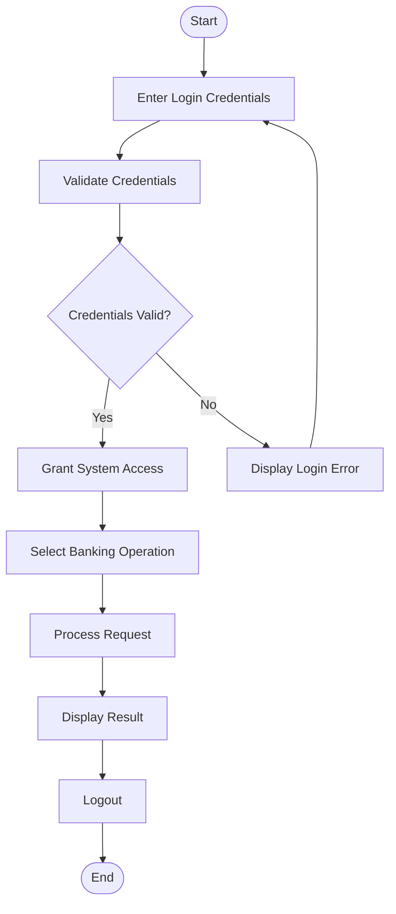
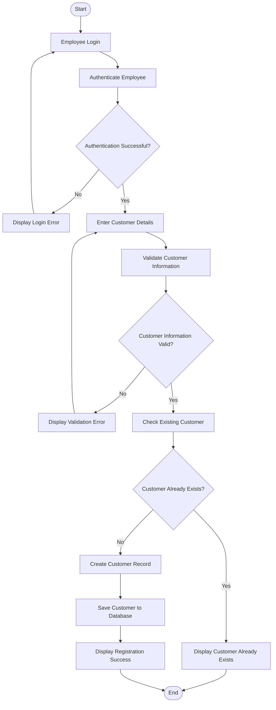
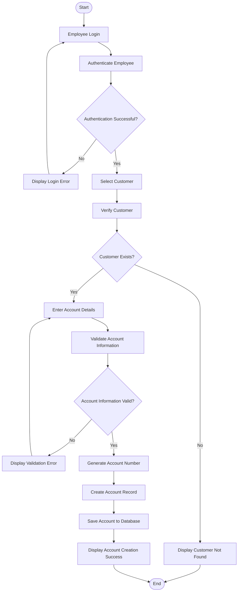
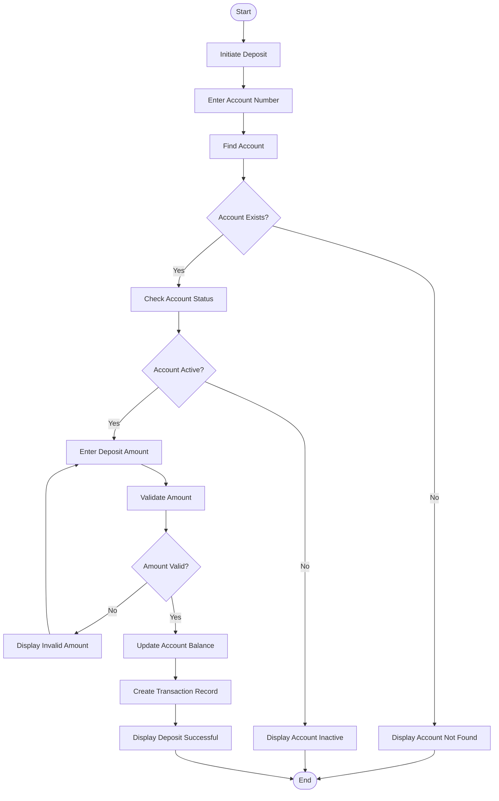
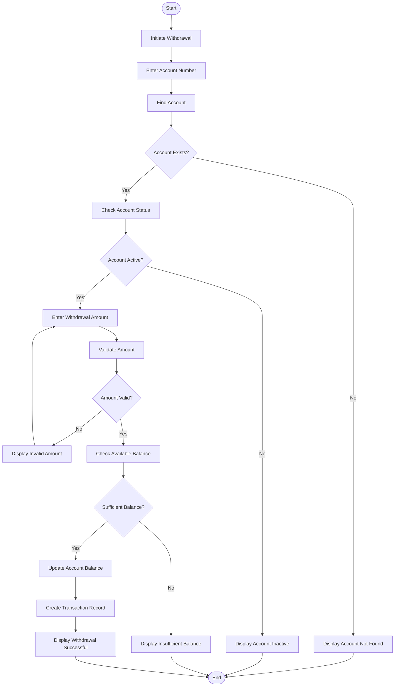
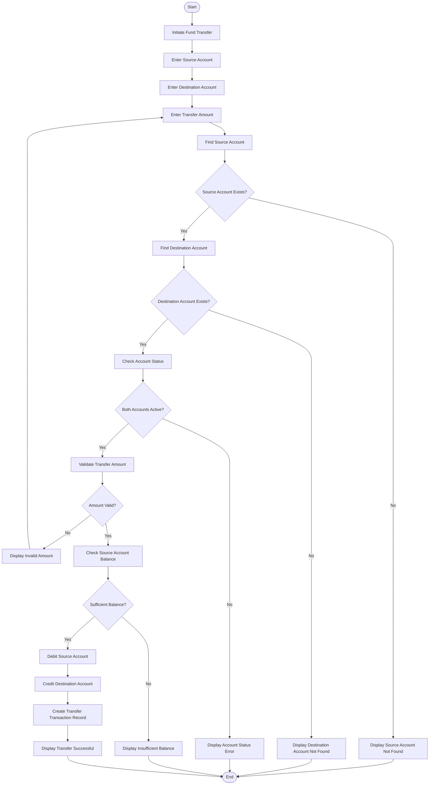
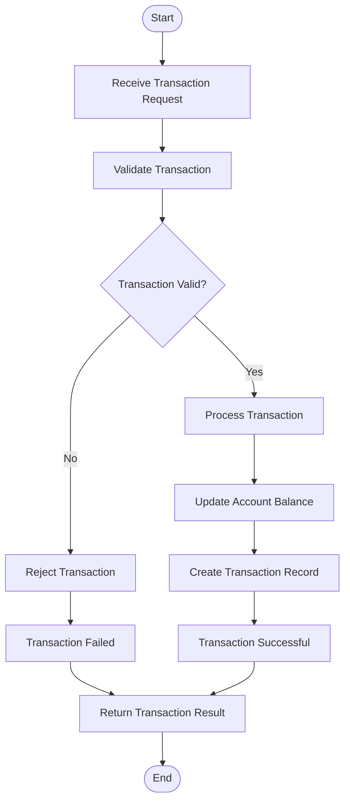
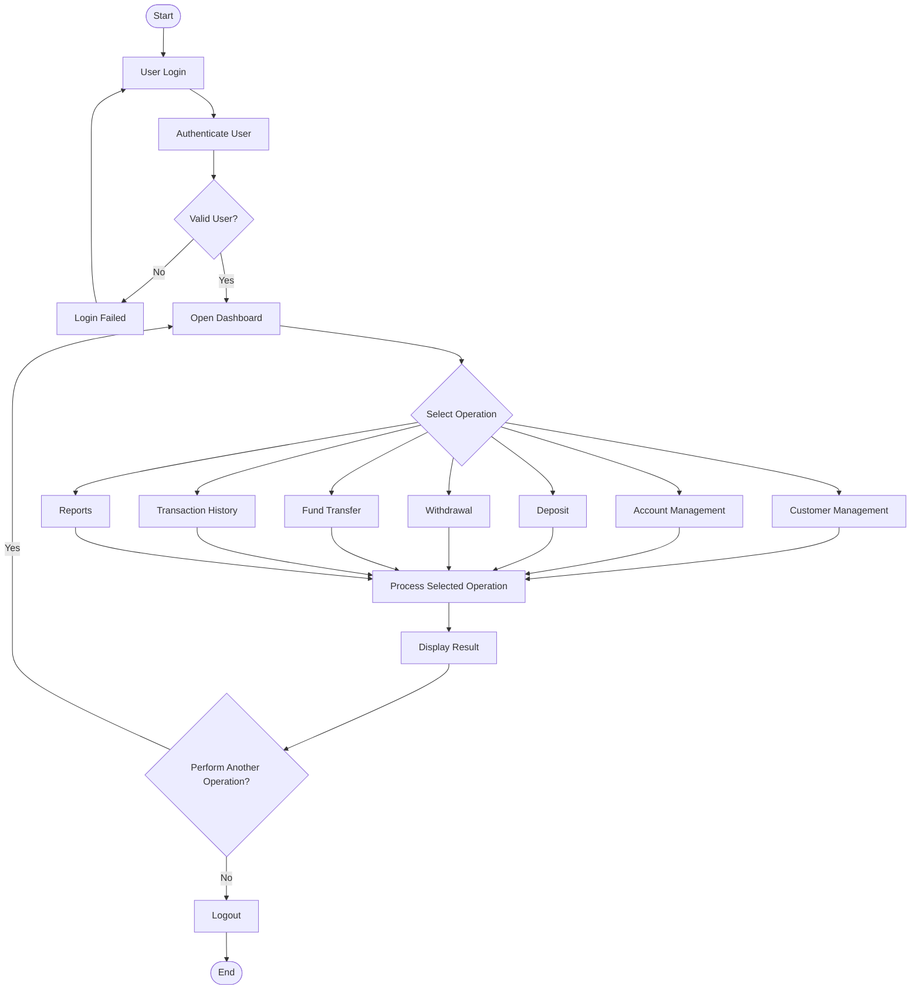

# Activity Diagram

## Banking Management System

The Activity Diagram represents the flow of activities performed within the
Banking Management System.

It describes how users interact with the system and how banking operations
progress from the initial request to completion.

The major workflows covered are:

- User authentication
- Customer registration
- Account creation
- Deposit
- Withdrawal
- Fund transfer
- Transaction processing

---

## Actors

The primary actors involved in the workflows are:

- **Admin** – Performs administrative and system management activities.
- **Employee** – Performs day-to-day banking operations.
- **Customer** – Performs personal banking activities.

---

## 1. General System Activity Flow

The general flow of the Banking Management System is:

---

# 2. Customer Registration Activity

The customer registration workflow allows an authorized employee to create a
new customer record.

---

# 3. Account Creation Activity

The account creation workflow allows an authorized employee to create a
bank account for an existing customer.

---

# 4. Deposit Activity

The deposit workflow represents adding money to a customer's account.

---

# 5. Withdrawal Activity

The withdrawal workflow represents removing money from a customer's account.

---

# 6. Fund Transfer Activity

The fund transfer workflow represents transferring money from one account to
another account.

---

# 7. Transaction Processing Flow

The transaction processing workflow represents the common processing path for
deposit, withdrawal, and transfer operations.

---

# 8. High-Level Banking Operation Flow

The main banking operations can be represented by the following high-level
workflow:

---

# Activity Flow Summary

| Workflow | Main Activities |
|---|---|
| Authentication | Login → Validate Credentials → Grant Access / Reject |
| Customer Registration | Enter Details → Validate → Check Existing Customer → Create Customer |
| Account Creation | Select Customer → Verify Customer → Enter Details → Generate Account → Create Account |
| Deposit | Identify Account → Validate Account → Validate Amount → Update Balance → Record Transaction |
| Withdrawal | Identify Account → Validate Account → Validate Amount → Check Balance → Update Balance → Record Transaction |
| Fund Transfer | Identify Accounts → Validate Accounts → Validate Amount → Check Balance → Debit → Credit → Record Transaction |
| Transaction Processing | Receive Request → Validate → Process → Update Balance → Record Transaction → Return Result |

---

# Relationship with Other Diagrams

The Activity Diagram represents the **behavioral workflow** of the Banking
Management System.

It complements the other system diagrams:

- **Architecture Diagram** – Describes the structural organization of the system.
- **ER Diagram** – Describes the database entities and their relationships.
- **Use Case Diagram** – Describes actors and system functionality.
- **Activity Diagram** – Describes the workflow of system operations.
- **Sequence Diagram** – Describes communication between system components over time.
- **Class Diagram** – Describes the application classes and their relationships.

Together, these diagrams provide structural, functional, data, and behavioral
views of the Banking Management System.