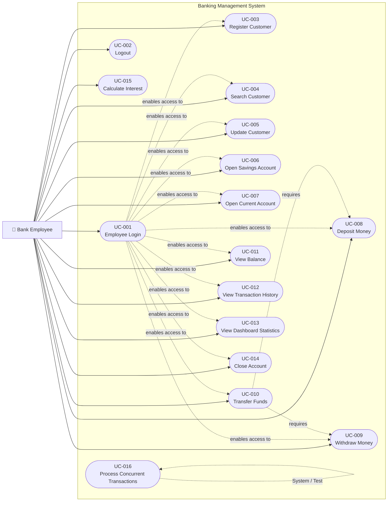

# Use Case Diagram

## Banking Management System Using Java

**Document:** Use Case Diagram
**Version:** 1.0
**Architecture:** Three-Tier Architecture
**Primary Actor:** Bank Employee
**Database:** MySQL 8

---

# 1. Purpose

The Use Case Diagram provides a high-level visual representation of the interactions between the **Bank Employee** and the Banking Management System.

The diagram identifies the major system functionalities available to an authenticated bank employee.

The use cases are derived from:

* `docs/SRS.md`
* `docs/requirements/requirement-analysis.md`
* `docs/requirements/functional-requirements.md`
* `docs/requirements/non-functional-requirements.md`
* `docs/requirements/business-rules.md`
* `docs/requirements/use-case-specifications.md`

---

# 2. Primary Actor

## Bank Employee

The **Bank Employee** is the primary actor who interacts with the Banking Management System.

The employee is responsible for performing day-to-day banking operations, including:

* Authentication
* Customer management
* Account management
* Deposits
* Withdrawals
* Fund transfers
* Balance enquiries
* Transaction history
* Dashboard monitoring
* Account closure

---

# 3. Supporting System

## MySQL Database

The MySQL database is the persistent data store used by the application.

It stores:

* Employee information
* Customer information
* Account information
* Transaction information

The application communicates with MySQL through the JDBC data-access layer.

The database is not modeled as a human actor because it is an internal supporting system component rather than a user interacting with the application.

---

# 4. Use Case Diagram



---

# 5. Use Case Groups

For clarity, the system use cases can be divided into the following functional groups.

## 5.1 Authentication

```text
UC-001 Employee Login
UC-002 Logout
```

These use cases control employee access to the application.

---

## 5.2 Customer Management

```text
UC-003 Register Customer
UC-004 Search Customer
UC-005 Update Customer
```

These use cases manage customer information.

---

## 5.3 Account Management

```text
UC-006 Open Savings Account
UC-007 Open Current Account
UC-014 Close Account
```

These use cases manage customer bank accounts.

---

## 5.4 Banking Transactions

```text
UC-008 Deposit Money
UC-009 Withdraw Money
UC-010 Transfer Funds
```

These use cases modify account balances and create transaction records.

---

## 5.5 Account Information

```text
UC-011 View Balance
UC-012 View Transaction History
```

These use cases allow employees to retrieve account information.

---

## 5.6 Reporting and Dashboard

```text
UC-013 View Dashboard Statistics
```

This use case provides summary information about the banking system.

---

## 5.7 Optional Features

```text
UC-015 Calculate Interest
```

Interest calculation is an optional feature for the initial project implementation.

---

## 5.8 Technical Demonstration

```text
UC-016 Process Concurrent Transactions
```

This use case exists primarily to demonstrate the project's Java multithreading and database concurrency requirements.

---

# 6. Use Case Descriptions

## UC-001 — Employee Login

Allows a bank employee to authenticate using valid credentials.

**Actor:** Bank Employee

**Primary Flow:**

```text
Enter Username
      ↓
Enter Password
      ↓
Validate Credentials
      ↓
Authenticate Employee
      ↓
Open Dashboard
```

---

## UC-002 — Logout

Allows an authenticated employee to terminate their application session.

**Actor:** Bank Employee

**Primary Flow:**

```text
Select Logout
      ↓
Terminate Session
      ↓
Return to Login Screen
```

---

## UC-003 — Register Customer

Allows an employee to create a new customer record.

**Actor:** Bank Employee

**Main Function:**

```text
Enter Customer Information
          ↓
Validate Information
          ↓
Check Customer ID
          ↓
Create Customer
          ↓
Save to Database
```

---

## UC-004 — Search Customer

Allows an employee to locate an existing customer.

**Actor:** Bank Employee

Search may be performed using appropriate customer identification information.

---

## UC-005 — Update Customer

Allows an employee to modify valid information associated with an existing customer.

---

## UC-006 — Open Savings Account

Allows an employee to create a Savings Account for an existing customer.

Important business rule:

```text
Minimum Savings Account Balance
= ₹1,000
```

---

## UC-007 — Open Current Account

Allows an employee to create a Current Account for an existing customer.

Important business rule:

```text
Maximum Overdraft
= ₹5,000

Minimum Permitted Balance
= -₹5,000
```

---

## UC-008 — Deposit Money

Allows an employee to deposit money into an active account.

Business rule:

```text
Deposit Amount > 0
```

A successful deposit increases the account balance.

---

## UC-009 — Withdraw Money

Allows an employee to withdraw money from an active account subject to account-specific balance restrictions.

### Savings Account

```text
Balance After Withdrawal >= ₹1,000
```

### Current Account

```text
Balance After Withdrawal >= -₹5,000
```

---

## UC-010 — Transfer Funds

Allows an employee to transfer money between two active accounts.

The transfer must satisfy:

```text
Source Account exists
Destination Account exists
Both accounts are active
Source != Destination
Amount > 0
Balance restriction satisfied
```

The transfer must be atomic.

```text
Debit Source
     +
Credit Destination
     +
Create Transaction Record
     ↓
   COMMIT
```

If an operation fails:

```text
ROLLBACK
```

---

## UC-011 — View Balance

Allows an employee to retrieve and display the current balance of an account.

---

## UC-012 — View Transaction History

Allows an employee to view transactions associated with an account.

Transaction information may include:

* Transaction ID
* Transaction Type
* Amount
* Status
* Timestamp
* Related Account

---

## UC-013 — View Dashboard Statistics

Allows an employee to view system-level statistics.

Possible statistics include:

* Total Customers
* Total Accounts
* Savings Accounts
* Current Accounts
* Active Accounts
* Closed Accounts
* Total Transactions
* Successful Transactions
* Failed Transactions

---

## UC-014 — Close Account

Allows an employee to close an active account.

After successful closure:

```text
Account Status = CLOSED
```

Historical transaction records remain available.

---

## UC-015 — Calculate Interest

Optional functionality for calculating and applying interest to eligible accounts.

The interest calculation policy will be finalized during implementation.

---

## UC-016 — Process Concurrent Transactions

Demonstrates multiple transaction operations executing concurrently.

The purpose is to demonstrate:

* Java threads
* Concurrent transaction processing
* Database transaction management
* Balance consistency
* Synchronization/concurrency handling

---

# 7. Authentication Dependency

Most operational use cases require successful employee authentication.

Conceptually:

```text
                    Employee
                       │
                       ▼
                 Employee Login
                       │
                       ▼
                Authenticated
                       │
       ┌───────────────┼─────────────────┐
       │               │                 │
       ▼               ▼                 ▼
   Customer         Accounts        Transactions
   Management       Management       Management
```

The Swing application should prevent unauthenticated employees from accessing protected banking screens.

---

# 8. Fund Transfer Relationship

Fund transfer is a composite banking operation.

Conceptually:

```text
              Transfer Funds
                    │
          ┌─────────┴─────────┐
          ▼                   ▼
    Withdraw From        Deposit Into
    Source Account      Destination Account
          │                   │
          └─────────┬─────────┘
                    ▼
             Transaction Record
                    │
                    ▼
                 COMMIT
```

All required database operations must succeed together.

If one operation fails:

```text
              Transfer Failure
                     │
                     ▼
                  ROLLBACK
                     │
                     ▼
            No Partial Transfer
```

---

# 9. Account Type Behavior

The two supported account types have different withdrawal policies.

```text
                  Account
                     │
            ┌────────┴────────┐
            │                 │
            ▼                 ▼
      Savings Account    Current Account
            │                 │
            ▼                 ▼
    Min Balance ₹1,000   Overdraft ₹5,000
```

This difference will later be represented in the UML class design through inheritance and polymorphism.

---

# 10. Use Case Traceability

| Use Case | Business Area       | Primary Business Rules |
| -------- | ------------------- | ---------------------- |
| UC-001   | Authentication      | BR-AUTH                |
| UC-002   | Authentication      | BR-AUTH-005            |
| UC-003   | Customer            | BR-CUST                |
| UC-004   | Customer            | BR-CUST-001            |
| UC-005   | Customer            | BR-CUST-005            |
| UC-006   | Account             | BR-ACC, BR-SAV         |
| UC-007   | Account             | BR-ACC, BR-CUR         |
| UC-008   | Deposit             | BR-DEP, BR-MONEY       |
| UC-009   | Withdrawal          | BR-WD, BR-SAV, BR-CUR  |
| UC-010   | Transfer            | BR-TRF                 |
| UC-011   | Account Information | BR-ACC                 |
| UC-012   | Transactions        | BR-TXN                 |
| UC-013   | Dashboard           | BR-TXN                 |
| UC-014   | Account Closure     | BR-CLOSE               |
| UC-015   | Interest            | BR-INT                 |
| UC-016   | Concurrency         | BR-CON                 |

---

# 11. Use Case Priority

## Critical

```text
UC-001 Employee Login
UC-008 Deposit Money
UC-009 Withdraw Money
UC-010 Transfer Funds
```

These use cases directly support core system operation and financial transactions.

## High

```text
UC-003 Register Customer
UC-004 Search Customer
UC-005 Update Customer
UC-006 Open Savings Account
UC-007 Open Current Account
UC-011 View Balance
UC-012 View Transaction History
```

## Medium

```text
UC-002 Logout
UC-013 Dashboard Statistics
UC-014 Close Account
```

## Optional

```text
UC-015 Calculate Interest
UC-016 Process Concurrent Transactions
```

---

# 12. Design Notes

The Use Case Diagram represents **functional behavior**, not implementation details.

The following technologies should therefore not be placed inside individual use cases:

* Java
* Swing
* JDBC
* MySQL
* DAO
* Service classes

These belong to the system architecture and design documents.

The use cases describe **what the system does**, while later UML and architecture diagrams will describe **how the system is structured to do it**.

---

# 13. Relationship to Future Design

The Use Case Diagram will be used to derive the following design artifacts:

```text
Use Case Diagram
       │
       ├──────────────► ER Diagram
       │
       ├──────────────► UML Class Diagram
       │
       ├──────────────► Sequence Diagrams
       │
       ├──────────────► Activity Diagrams
       │
       └──────────────► Swing UI Design
```

For example:

```text
UC-010 Transfer Funds
        │
        ├── TransferService
        ├── AccountDAO
        ├── TransactionDAO
        ├── Account
        ├── Transaction
        └── Database Transaction
```

This mapping will be developed during the detailed design phase.

---

# 14. Document Status

**Document:** Use Case Diagram
**Version:** 1.0
**Status:** Completed

### Related Documents

```text
docs/SRS.md

docs/requirements/
├── requirement-analysis.md
├── functional-requirements.md
├── non-functional-requirements.md
├── business-rules.md
└── use-case-specifications.md
```

### Next Design Artifact

```text
docs/diagrams/er-diagram.md
```

The next major design step is the **Entity Relationship Diagram**, which will identify the database entities, attributes, primary keys, foreign keys, and relationships required by the Banking Management System.

---

**End of Use Case Diagram**
