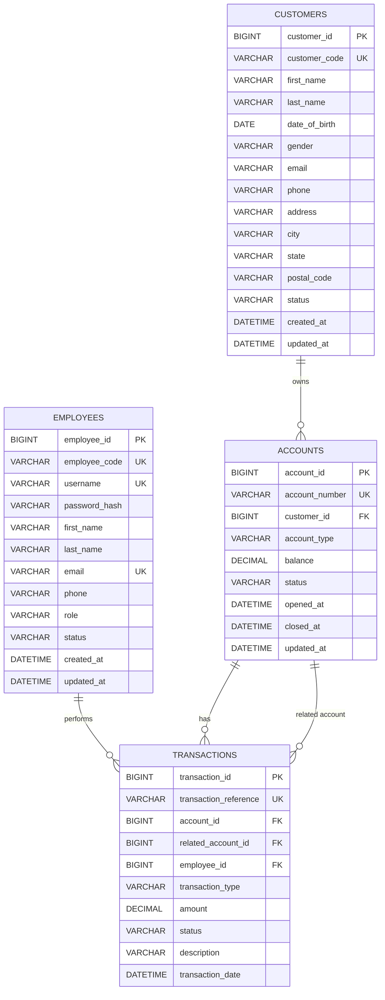

# Entity Relationship Diagram

## Banking Management System Using Java

**Document:** Entity Relationship Diagram
**Version:** 1.0
**Database:** MySQL 8
**Data Access:** JDBC
**Architecture:** Three-Tier Architecture

### Related Documents

* `docs/SRS.md`
* `docs/requirements/requirement-analysis.md`
* `docs/requirements/functional-requirements.md`
* `docs/requirements/non-functional-requirements.md`
* `docs/requirements/business-rules.md`
* `docs/requirements/use-case-specifications.md`
* `docs/diagrams/use-case-diagram.md`

---

# 1. Purpose

The Entity Relationship Diagram (ERD) defines the logical data model for the Banking Management System.

It identifies:

* Database entities
* Attributes
* Primary keys
* Foreign keys
* Relationships
* Cardinality
* Data ownership
* Referential integrity

The ERD will serve as the foundation for:

```text
ER Diagram
    ↓
Relational Database Design
    ↓
MySQL Schema
    ↓
SQL Scripts
    ↓
JDBC DAO Layer
```

---

# 2. Database Entities

The initial Banking Management System will contain four core entities:

```text
employees
customers
accounts
transactions
```

The relationship structure is:

```text
Employee
   │
   │ performs
   ▼
Transactions
   ▲
   │ belongs to
Account
   ▲
   │ owned by
   │
Customer
```

---

# 3. Entity Overview

| Entity         | Purpose                                                   |
| -------------- | --------------------------------------------------------- |
| `employees`    | Stores bank employee login and identification information |
| `customers`    | Stores customer information                               |
| `accounts`     | Stores customer bank accounts                             |
| `transactions` | Stores financial transaction history                      |

---

# 4. ER Diagram

The following Mermaid ER diagram represents the proposed database structure.



---

# 5. Entity: EMPLOYEES

## 5.1 Purpose

The `employees` entity stores information about bank employees who are authorized to use the Banking Management System.

Employees are the primary users of the desktop application.

---

## 5.2 Attributes

| Attribute       | Data Type | Key | Description                             |
| --------------- | --------- | --- | --------------------------------------- |
| `employee_id`   | BIGINT    | PK  | Unique internal employee identifier     |
| `employee_code` | VARCHAR   | UK  | Unique employee identification code     |
| `username`      | VARCHAR   | UK  | Employee login username                 |
| `password_hash` | VARCHAR   |     | Securely stored password representation |
| `first_name`    | VARCHAR   |     | Employee first name                     |
| `last_name`     | VARCHAR   |     | Employee last name                      |
| `email`         | VARCHAR   | UK  | Employee email address                  |
| `phone`         | VARCHAR   |     | Employee contact number                 |
| `role`          | VARCHAR   |     | Employee role                           |
| `status`        | VARCHAR   |     | Employee account status                 |
| `created_at`    | DATETIME  |     | Record creation timestamp               |
| `updated_at`    | DATETIME  |     | Last update timestamp                   |

---

## 5.3 Primary Key

```text
employee_id
```

The primary key uniquely identifies each employee.

---

## 5.4 Unique Constraints

The following values should be unique:

```text
employee_code
username
email
```

---

## 5.5 Employee Status

Initially supported statuses may include:

```text
ACTIVE
INACTIVE
```

---

# 6. Entity: CUSTOMERS

## 6.1 Purpose

The `customers` entity stores personal and contact information for customers of the bank.

---

## 6.2 Attributes

| Attribute       | Data Type | Key | Description                               |
| --------------- | --------- | --- | ----------------------------------------- |
| `customer_id`   | BIGINT    | PK  | Internal unique customer identifier       |
| `customer_code` | VARCHAR   | UK  | Business-level unique customer identifier |
| `first_name`    | VARCHAR   |     | Customer first name                       |
| `last_name`     | VARCHAR   |     | Customer last name                        |
| `date_of_birth` | DATE      |     | Customer date of birth                    |
| `gender`        | VARCHAR   |     | Customer gender                           |
| `email`         | VARCHAR   |     | Customer email                            |
| `phone`         | VARCHAR   |     | Customer phone number                     |
| `address`       | VARCHAR   |     | Customer address                          |
| `city`          | VARCHAR   |     | Customer city                             |
| `state`         | VARCHAR   |     | Customer state                            |
| `postal_code`   | VARCHAR   |     | Customer postal code                      |
| `status`        | VARCHAR   |     | Customer status                           |
| `created_at`    | DATETIME  |     | Record creation timestamp                 |
| `updated_at`    | DATETIME  |     | Last update timestamp                     |

---

## 6.3 Primary Key

```text
customer_id
```

---

## 6.4 Business Identifier

The system shall maintain a unique:

```text
customer_code
```

This represents the customer-facing/business identifier.

The internal database identifier remains:

```text
customer_id
```

This separation provides flexibility if the business identifier format changes in the future.

---

## 6.5 Customer Status

Possible values:

```text
ACTIVE
INACTIVE
```

---

# 7. Entity: ACCOUNTS

## 7.1 Purpose

The `accounts` entity stores bank account information belonging to customers.

It supports:

* Savings Accounts
* Current Accounts

---

## 7.2 Attributes

| Attribute        | Data Type | Key | Description                           |
| ---------------- | --------- | --- | ------------------------------------- |
| `account_id`     | BIGINT    | PK  | Internal unique account identifier    |
| `account_number` | VARCHAR   | UK  | Unique customer-facing account number |
| `customer_id`    | BIGINT    | FK  | Owner of the account                  |
| `account_type`   | VARCHAR   |     | SAVINGS or CURRENT                    |
| `balance`        | DECIMAL   |     | Current account balance               |
| `status`         | VARCHAR   |     | Account status                        |
| `opened_at`      | DATETIME  |     | Account opening timestamp             |
| `closed_at`      | DATETIME  |     | Account closure timestamp             |
| `updated_at`     | DATETIME  |     | Last balance/data update              |

---

# 8. Account Primary Key

The internal primary key is:

```text
account_id
```

This uniquely identifies an account internally.

---

# 9. Account Number

The customer-facing account identifier is:

```text
account_number
```

It must be unique.

Example:

```text
1000000001
1000000002
1000000003
```

The actual account-number generation strategy will be defined during database implementation.

---

# 10. Account Type

The system initially supports:

```text
SAVINGS
CURRENT
```

The final implementation may enforce these values using a MySQL `CHECK` constraint.

---

# 11. Account Status

Initially supported statuses:

```text
ACTIVE
CLOSED
```

An account marked `CLOSED` shall not perform normal banking transactions.

---

# 12. Account Balance

The balance shall be stored using:

```text
DECIMAL
```

rather than floating-point data types.

The Java implementation shall preferably use:

```java
BigDecimal
```

for monetary calculations.

---

# 13. Savings Account Rules

For an account where:

```text
account_type = SAVINGS
```

the minimum allowed balance after a withdrawal or transfer is:

```text
₹1,000
```

Business rule:

```text
balance_after_transaction >= 1000
```

---

# 14. Current Account Rules

For an account where:

```text
account_type = CURRENT
```

the account may use an overdraft facility up to:

```text
₹5,000
```

Therefore:

```text
minimum_allowed_balance = -5000
```

Business rule:

```text
balance_after_transaction >= -5000
```

---

# 15. Entity: TRANSACTIONS

## 15.1 Purpose

The `transactions` entity stores the history of financial operations performed on accounts.

Transactions include:

* Deposits
* Withdrawals
* Transfers
* Optional interest transactions

---

# 16. Transaction Attributes

| Attribute               | Data Type | Key | Description                                 |
| ----------------------- | --------- | --- | ------------------------------------------- |
| `transaction_id`        | BIGINT    | PK  | Internal transaction identifier             |
| `transaction_reference` | VARCHAR   | UK  | Unique transaction reference                |
| `account_id`            | BIGINT    | FK  | Primary account associated with transaction |
| `related_account_id`    | BIGINT    | FK  | Related account for transfers               |
| `employee_id`           | BIGINT    | FK  | Employee who performed the transaction      |
| `transaction_type`      | VARCHAR   |     | DEPOSIT, WITHDRAWAL, TRANSFER, etc.         |
| `amount`                | DECIMAL   |     | Transaction amount                          |
| `status`                | VARCHAR   |     | SUCCESS or FAILED                           |
| `description`           | VARCHAR   |     | Optional transaction description            |
| `transaction_date`      | DATETIME  |     | Transaction timestamp                       |

---

# 17. Transaction Primary Key

The primary key is:

```text
transaction_id
```

---

# 18. Transaction Reference

Each transaction shall have a unique business-level transaction reference:

```text
transaction_reference
```

Example:

```text
TXN-2026-000001
TXN-2026-000002
TXN-2026-000003
```

The exact generation strategy will be determined during implementation.

---

# 19. Transaction Types

The initial transaction types are:

```text
DEPOSIT
WITHDRAWAL
TRANSFER
```

Optional:

```text
INTEREST
```

---

# 20. Transaction Status

Supported statuses:

```text
SUCCESS
FAILED
```

A failed transaction may be retained for audit and troubleshooting purposes according to the final transaction logging policy.

---

# 21. Relationship: CUSTOMER → ACCOUNT

## 21.1 Relationship

```text
CUSTOMER ||--o{ ACCOUNT
```

A customer can own multiple accounts.

---

## 21.2 Cardinality

```text
Customer : Account
1 : Many
```

Meaning:

```text
One Customer
     │
     ├── Savings Account
     ├── Current Account
     └── Other permitted accounts
```

A single account belongs to exactly one customer.

---

# 22. Relationship: ACCOUNT → TRANSACTION

## 22.1 Relationship

```text
ACCOUNT ||--o{ TRANSACTION
```

One account can have zero or many transactions.

---

## 22.2 Cardinality

```text
Account : Transaction
1 : Many
```

Example:

```text
Account
   │
   ├── Deposit
   ├── Withdrawal
   ├── Transfer
   ├── Deposit
   └── Withdrawal
```

---

# 23. Relationship: EMPLOYEE → TRANSACTION

## 23.1 Relationship

An employee may perform many banking transactions.

```text
EMPLOYEE ||--o{ TRANSACTION
```

Cardinality:

```text
Employee : Transaction
1 : Many
```

A transaction may optionally reference the employee responsible for processing it, depending on the final audit policy.

---

# 24. Relationship: ACCOUNT → RELATED ACCOUNT

Transfers involve two accounts:

```text
Source Account
Destination Account
```

The `transactions` entity therefore contains:

```text
account_id
related_account_id
```

For example:

```text
account_id = Source Account
related_account_id = Destination Account
```

This allows a transfer transaction to identify both sides of the operation.

---

# 25. Transfer Data Model

Conceptually:

```text
             TRANSFER
                 │
       ┌─────────┴─────────┐
       │                   │
       ▼                   ▼
Source Account       Destination Account
account_id           related_account_id
       │                   │
       ▼                   ▼
     DEBIT               CREDIT
```

The actual balance changes shall occur inside a database transaction.

---

# 26. Referential Integrity

The database shall maintain referential integrity through foreign keys.

## Account → Customer

```text
accounts.customer_id
        ↓
customers.customer_id
```

---

## Transaction → Account

```text
transactions.account_id
        ↓
accounts.account_id
```

---

## Transaction → Related Account

```text
transactions.related_account_id
        ↓
accounts.account_id
```

---

## Transaction → Employee

```text
transactions.employee_id
        ↓
employees.employee_id
```

---

# 27. Delete Behavior

The system should avoid cascading deletion of financial history.

For example, deleting a customer should not automatically delete:

```text
Customer
   ↓
Accounts
   ↓
Transactions
```

because transaction history must be preserved.

The final SQL schema should therefore use appropriate foreign-key deletion behavior such as:

```text
RESTRICT
```

or another explicitly justified strategy.

---

# 28. Normalization

The database design follows relational database normalization principles.

The proposed design targets at least:

```text
First Normal Form (1NF)
Second Normal Form (2NF)
Third Normal Form (3NF)
```

---

## 28.1 First Normal Form

Each table contains atomic attributes.

For example, customer contact information is stored in separate fields:

```text
first_name
last_name
email
phone
```

rather than storing multiple values inside a single field.

---

## 28.2 Second Normal Form

Non-key attributes depend on the complete primary key of their entity.

---

## 28.3 Third Normal Form

Non-key attributes should not depend on other non-key attributes.

For example, customer information is stored in the `customers` table rather than duplicated in every account record.

---

# 29. Data Ownership

The ownership hierarchy is:

```text
Customer
   │
   └── Accounts
          │
          └── Transactions
```

Employees operate on the system but do not own customer accounts.

---

# 30. Database Integrity Rules

The database should enforce the following constraints where appropriate:

### Primary Keys

```text
employees.employee_id
customers.customer_id
accounts.account_id
transactions.transaction_id
```

### Unique Constraints

```text
employees.employee_code
employees.username
employees.email
customers.customer_code
accounts.account_number
transactions.transaction_reference
```

### Foreign Keys

```text
accounts.customer_id
transactions.account_id
transactions.related_account_id
transactions.employee_id
```

### NOT NULL Constraints

Mandatory business fields should use:

```text
NOT NULL
```

---

# 31. Recommended Indexes

Indexes should be created for frequently searched fields.

Recommended indexes include:

```text
employees.username
employees.employee_code
customers.customer_code
customers.phone
customers.email
accounts.account_number
accounts.customer_id
transactions.account_id
transactions.transaction_date
transactions.transaction_reference
```

The final index strategy may be adjusted after query patterns are established.

---

# 32. Entity Relationship Summary

```text
┌─────────────────┐
│   EMPLOYEES     │
├─────────────────┤
│ PK employee_id  │
│ UK username     │
│ UK email        │
│ ...             │
└────────┬────────┘
         │
         │ performs
         │
         ▼
┌─────────────────────┐
│    TRANSACTIONS     │
├─────────────────────┤
│ PK transaction_id   │
│ UK reference        │
│ FK account_id       │
│ FK related_account  │
│ FK employee_id      │
│ type                │
│ amount              │
│ status              │
│ date                │
└──────────┬──────────┘
           │
           │ belongs to
           │
           ▼
┌─────────────────────┐
│      ACCOUNTS       │
├─────────────────────┤
│ PK account_id      │
│ UK account_number  │
│ FK customer_id     │
│ account_type       │
│ balance            │
│ status             │
│ opened_at          │
│ closed_at          │
└──────────┬──────────┘
           │
           │ owned by
           │
           ▼
┌─────────────────────┐
│     CUSTOMERS       │
├─────────────────────┤
│ PK customer_id      │
│ UK customer_code    │
│ first_name          │
│ last_name           │
│ date_of_birth       │
│ email               │
│ phone               │
│ address             │
│ status              │
└─────────────────────┘
```

---

# 33. Mapping to Java Domain Model

The database entities will later map approximately to Java domain objects:

```text
employees
     ↓
Employee

customers
     ↓
Customer

accounts
     ↓
Account
   ├── SavingsAccount
   └── CurrentAccount

transactions
     ↓
Transaction
```

The exact Java class structure will be finalized during the UML Class Diagram phase.

---

# 34. Mapping to DAO Layer

The ER model will map to DAO components approximately as follows:

```text
employees
     ↓
EmployeeDAO

customers
     ↓
CustomerDAO

accounts
     ↓
AccountDAO

transactions
     ↓
TransactionDAO
```

The DAO layer will be responsible for JDBC database access.

---

# 35. Mapping to Service Layer

Business operations will be handled by services rather than directly from Swing UI components.

Potential services include:

```text
EmployeeService
CustomerService
AccountService
TransactionService
DepositService
WithdrawalService
TransferService
```

The final service structure will be determined during the class design phase.

---

# 36. Transfer Transaction Model

A fund transfer requires two account balance operations:

```text
Source Account
     │
     ▼
DEBIT
     │
     ├──────────────┐
     │              │
     ▼              ▼
Transaction     Destination
Record          Account
                    │
                    ▼
                  CREDIT
```

All related operations must be handled within a database transaction:

```text
BEGIN TRANSACTION

1. Validate source account
2. Validate destination account
3. Validate transfer amount
4. Validate balance restriction
5. Debit source
6. Credit destination
7. Insert transaction record

COMMIT
```

If any step fails:

```text
ROLLBACK
```

---

# 37. Concurrency Considerations

The database design must support safe concurrent account operations.

Potential concurrency problems include:

* Lost updates
* Incorrect balances
* Double spending
* Inconsistent transfer results

The implementation will address these through appropriate:

* JDBC transaction handling
* Database transaction isolation
* Row-level locking or equivalent strategy
* Atomic update operations
* Java concurrency mechanisms where required

The exact implementation will be finalized during the database and Java implementation phases.

---

# 38. Design Decisions

## Decision 1 — Separate Internal IDs and Business IDs

The design uses internal numeric identifiers such as:

```text
customer_id
account_id
transaction_id
```

and separate business identifiers such as:

```text
customer_code
account_number
transaction_reference
```

This allows internal database relationships to remain stable even if customer-facing identifiers change.

---

## Decision 2 — DECIMAL for Monetary Values

The database shall use:

```text
DECIMAL
```

for account balances and transaction amounts.

Java shall use:

```text
BigDecimal
```

for monetary calculations.

---

## Decision 3 — Preserve Transaction History

Transaction records should not be deleted simply because an account is closed.

---

## Decision 4 — Account Status Instead of Deletion

Accounts should normally be marked:

```text
CLOSED
```

rather than physically deleted.

---

# 39. Assumptions

The ER design assumes:

1. One customer may own multiple accounts.
2. Each account belongs to exactly one customer.
3. An account has one account type.
4. Each account has one current balance.
5. An account may have zero or many transactions.
6. An employee may perform many transactions.
7. A transfer may reference both source and destination accounts.
8. Transaction history should be retained.
9. Currency is initially INR.
10. Only Savings and Current accounts are required for the initial implementation.

---

# 40. Future Extensions

The ER model can later be extended to support:

```text
beneficiaries
loans
fixed_deposits
recurring_deposits
joint_accounts
branches
employee_roles
audit_logs
scheduled_transfers
```

These are outside the current database scope.

---

# 41. ER Diagram to SQL Mapping

The next database-design stage will transform this logical ER model into physical MySQL tables.

The planned order is:

```text
ER Diagram
     ↓
Define Data Types
     ↓
Define Primary Keys
     ↓
Define Foreign Keys
     ↓
Define Constraints
     ↓
Define Indexes
     ↓
CREATE TABLE Statements
     ↓
INSERT Sample Data
     ↓
Test Database
```

---

# 42. Traceability

| Requirement Area      | ER Entity                               |
| --------------------- | --------------------------------------- |
| Employee Login        | `employees`                             |
| Customer Registration | `customers`                             |
| Customer Search       | `customers`                             |
| Customer Update       | `customers`                             |
| Open Account          | `accounts`                              |
| Savings Account       | `accounts`                              |
| Current Account       | `accounts`                              |
| Deposit               | `accounts`, `transactions`              |
| Withdrawal            | `accounts`, `transactions`              |
| Fund Transfer         | `accounts`, `transactions`              |
| Balance Enquiry       | `accounts`                              |
| Transaction History   | `transactions`                          |
| Dashboard Statistics  | `customers`, `accounts`, `transactions` |
| Account Closure       | `accounts`                              |
| Interest              | `accounts`, `transactions`              |
| Concurrency           | `accounts`, `transactions`              |

---

# 43. Final Entity Relationship Model

The finalized initial database model is:

```text
                    ┌───────────────┐
                    │   EMPLOYEES   │
                    └───────┬───────┘
                            │
                         1  │
                            │ N
                            ▼
                    ┌───────────────┐
                    │ TRANSACTIONS  │
                    └───────┬───────┘
                            │
                         N  │
                            │ 1
                            ▼
                    ┌───────────────┐
                    │    ACCOUNTS   │
                    └───────┬───────┘
                            │
                         N  │
                            │ 1
                            ▼
                    ┌───────────────┐
                    │   CUSTOMERS   │
                    └───────────────┘
```

Additionally:

```text
ACCOUNTS
   │
   └────── related_account_id ──────► ACCOUNTS
```

This self-reference supports identifying the second account involved in a transfer.

---

# 44. Document Status

**Document:** Entity Relationship Diagram
**Version:** 1.0
**Status:** Completed

### Previous Design Artifact

```text
docs/diagrams/use-case-diagram.md
```

### Next Design Artifact

```text
docs/database/database-design.md
```

The next step is to convert this logical ER model into a detailed **physical database design**, including exact MySQL data types, constraints, indexes, relationships, and table definitions.

---

**End of Entity Relationship Diagram**
