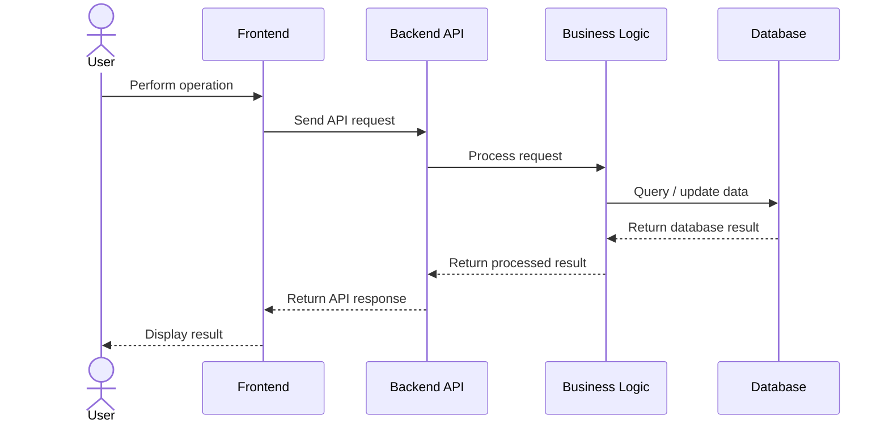
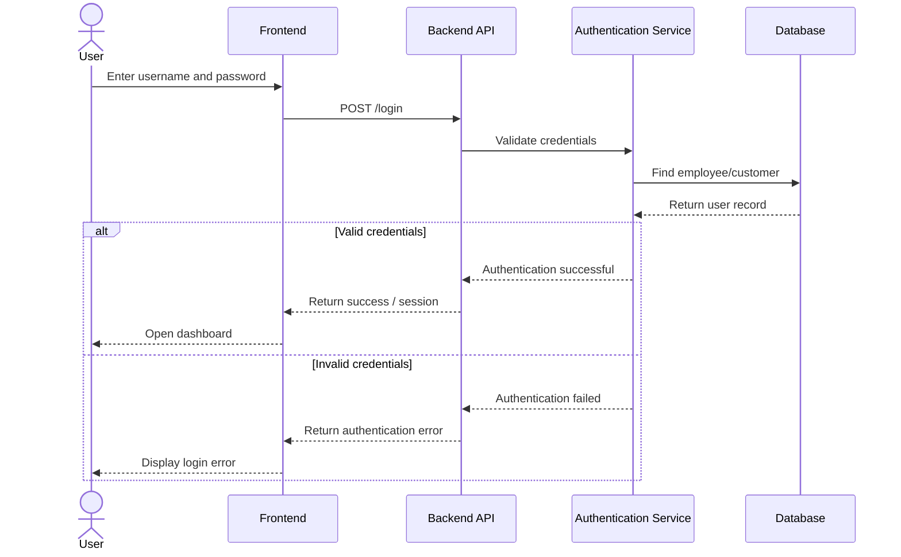
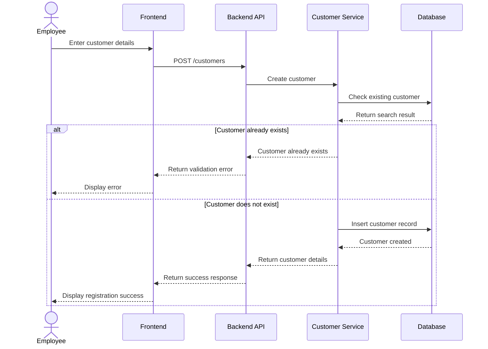
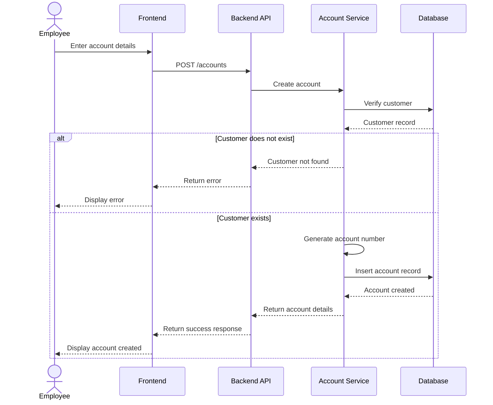
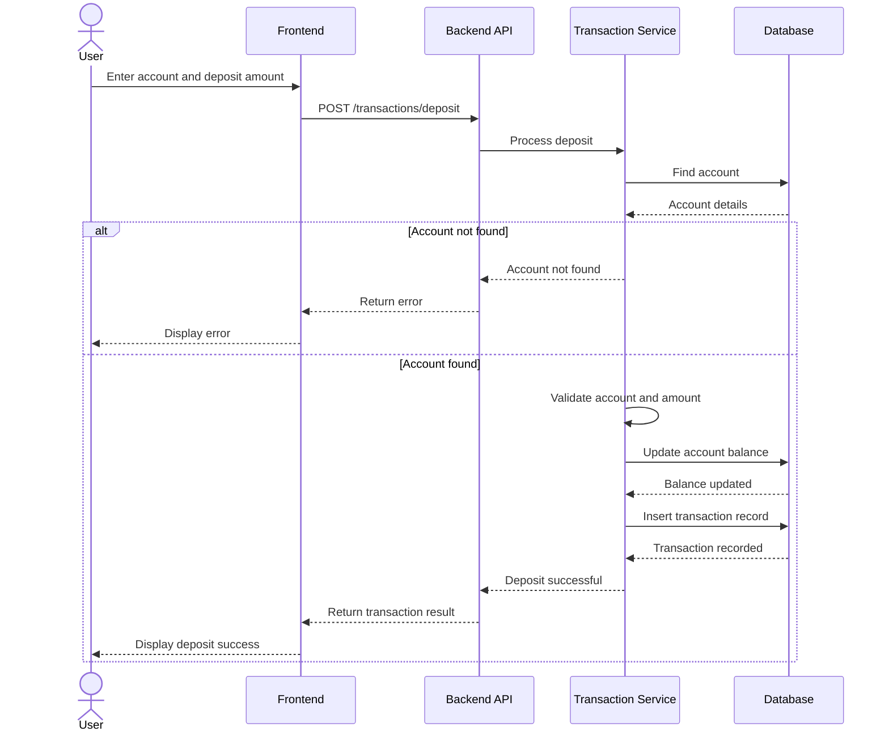
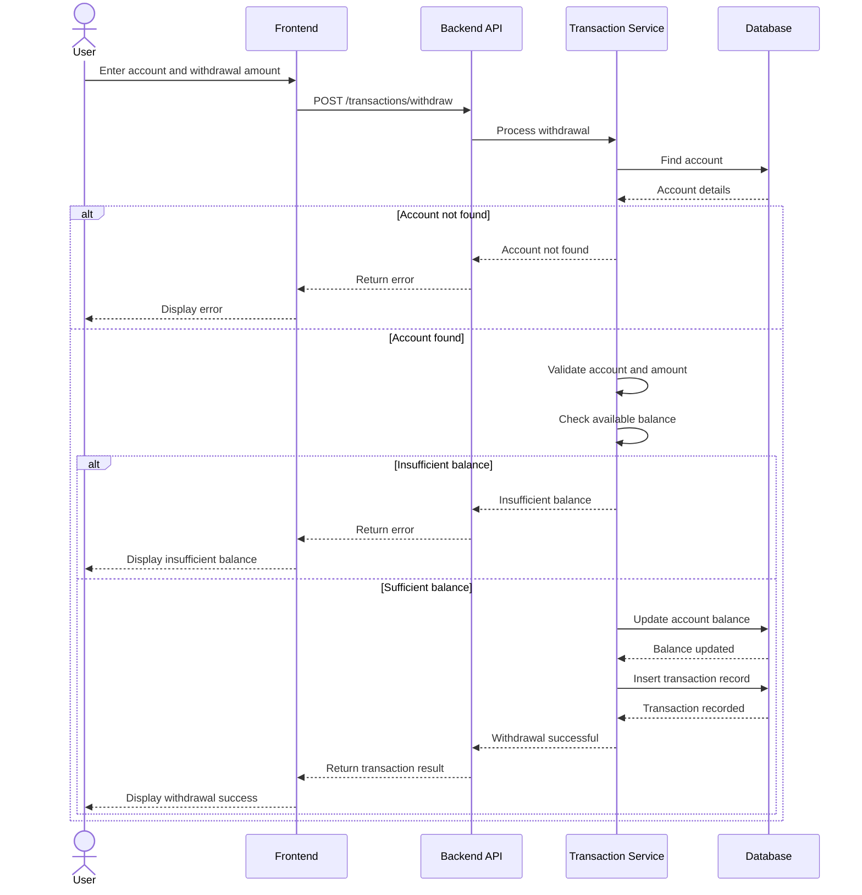
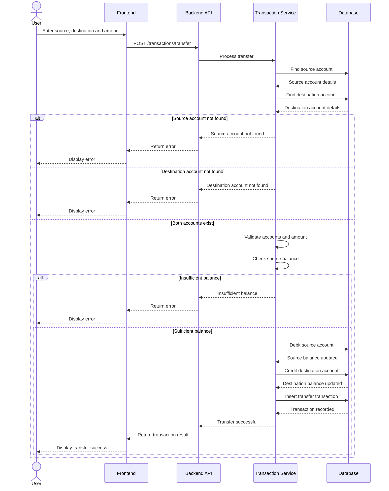
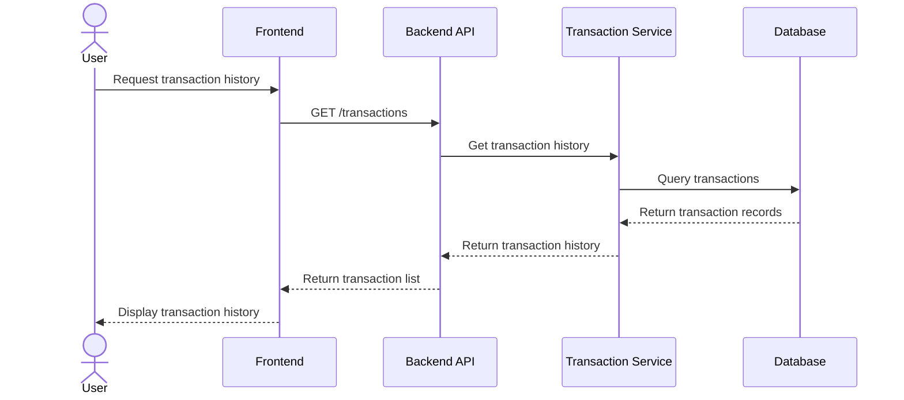
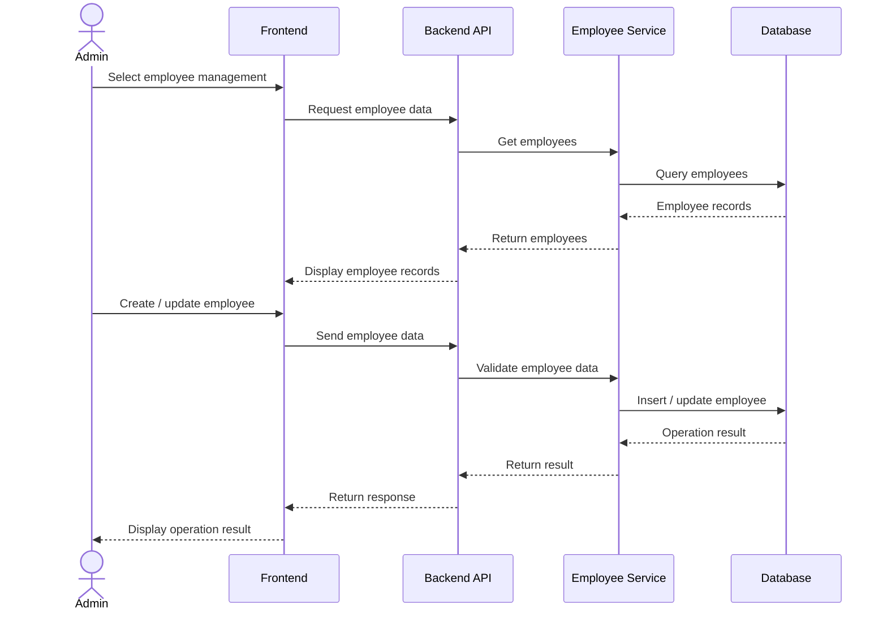
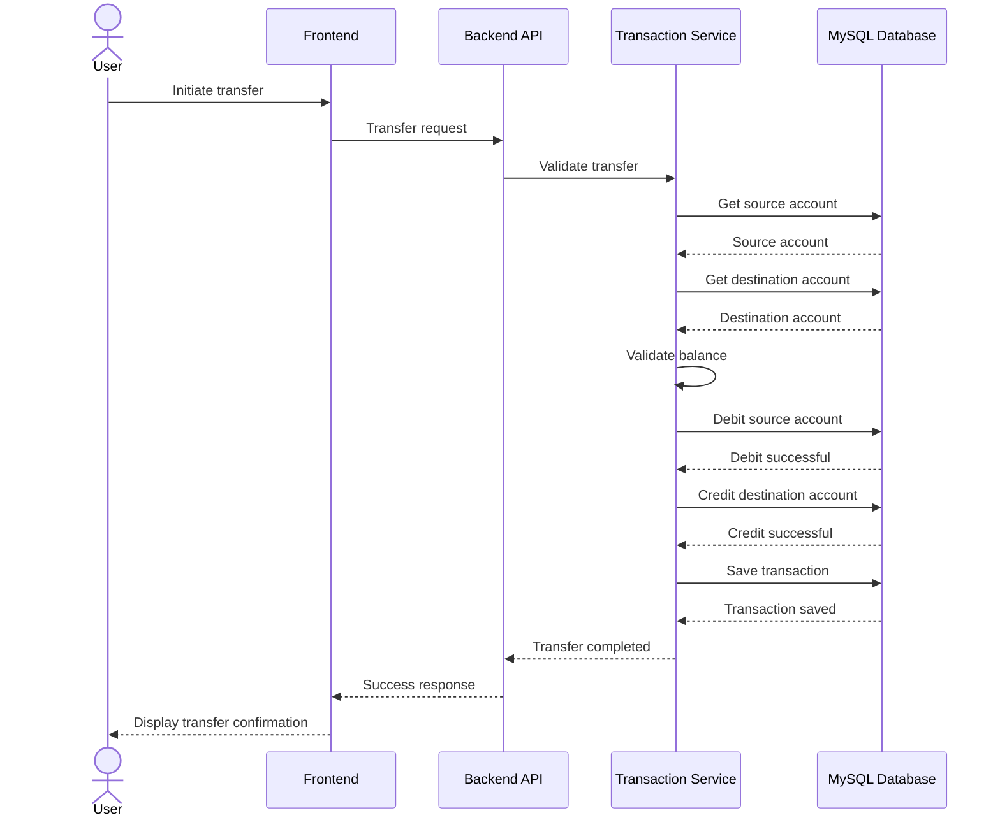

# Sequence Diagram

## Banking Management System

The Sequence Diagram represents the interaction between users and the
different components of the Banking Management System over time.

It shows how requests move through the system from the user interface to
the backend application, business logic, and database.

The main components involved are:

- **Actor** – Admin, Employee, or Customer
- **Frontend** – User interface
- **Backend API** – Handles HTTP requests
- **Authentication / Business Logic** – Validates and processes requests
- **Database** – Stores and retrieves system data

---

# 1. General System Request Flow

The general request flow follows:

```text
User
  ↓
Frontend
  ↓
Backend API
  ↓
Business Logic
  ↓
Database
  ↓
Business Logic
  ↓
Backend API
  ↓
Frontend
  ↓
User
```



---

# 2. Login Sequence

The login sequence describes how a user authenticates with the system.



---

# 3. Customer Registration Sequence

This sequence represents the creation of a new customer.



---

# 4. Account Creation Sequence

This sequence represents creating a new bank account for a customer.



---

# 5. Deposit Sequence

This sequence represents depositing money into an account.



---

# 6. Withdrawal Sequence

This sequence represents withdrawing money from an account.



---

# 7. Fund Transfer Sequence

This sequence represents transferring money between two accounts.



---

# 8. Transaction History Sequence

This sequence represents retrieving transaction history for an account.



---

# 9. Admin Employee Management Sequence

This sequence represents an Admin managing employee records.



---

# 10. Sequence of a Successful Fund Transfer

The complete successful transfer interaction can be summarized as:



---

# Sequence Diagram Summary

| Operation | Main Interaction |
|---|---|
| Login | User → Frontend → API → Authentication → Database |
| Customer Registration | Employee → Frontend → API → Customer Service → Database |
| Account Creation | Employee → Frontend → API → Account Service → Database |
| Deposit | User → Frontend → API → Transaction Service → Database |
| Withdrawal | User → Frontend → API → Transaction Service → Database |
| Fund Transfer | User → Frontend → API → Transaction Service → Database |
| Transaction History | User → Frontend → API → Transaction Service → Database |
| Employee Management | Admin → Frontend → API → Employee Service → Database |

---

# Relationship with Other Diagrams

The Sequence Diagram provides the **interaction and time-based view** of the
Banking Management System.

It complements the other diagrams:

- **Architecture Diagram** – Defines the structural layers and components.
- **ER Diagram** – Defines database entities and relationships.
- **Use Case Diagram** – Defines actors and system functionality.
- **Activity Diagram** – Defines operational workflows.
- **Sequence Diagram** – Defines communication between actors and system components.
- **Class Diagram** – Defines application classes and their relationships.

The sequence diagrams demonstrate how the functional requirements represented
in the Use Case Diagram and Activity Diagram can be implemented through the
system architecture and database.